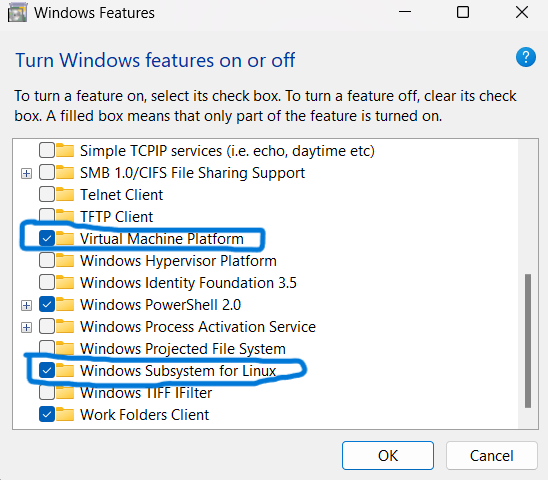
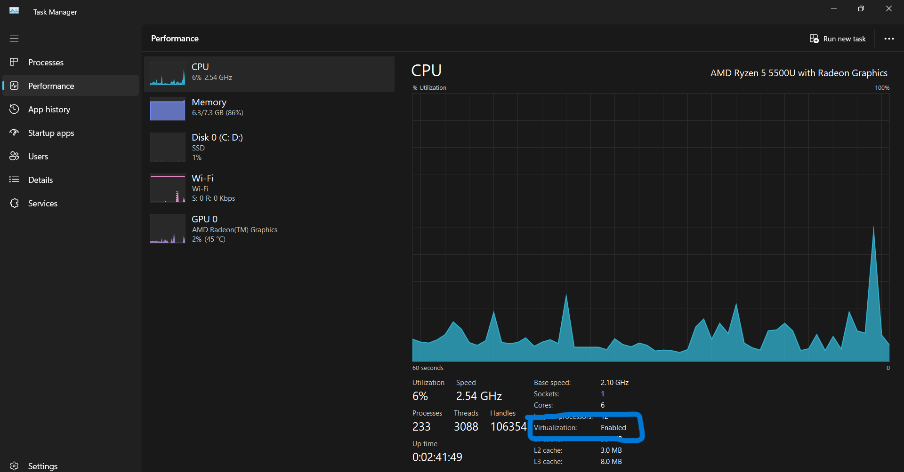
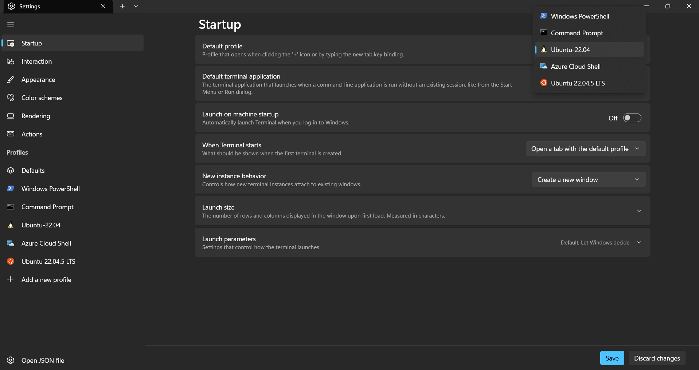

# ROS2 humble in windows using WSL
This packages aims to provide the step by step processes to install ubuntu 22 and ROS2 humble on windows using wsl and also run turtlebot3 packages alongside.

## 1. Pre-requisites :
- Go to search & type 'Turn windows features on or off' & select the following checkboxes
   
<div align="center">
  
</div>

- Open Task Manager & go to Performance Section. Check if virtualization is enabled or not. If not, then enable it from your bios mode.
<div align="center">
  
</div>
  
- Open windows powershell as administrator & type the following commands
```
wsl --update
wsl --list --online
wsl --install -d Ubuntu-22.04
```
- Create a new user in ubuntu22 by providing a username & password.
- Check if the ubuntu is installed or not
```
lsb_release -a
```
- Now you can Open the terminal from your windows 8 select Ubuntu22 to run ubuntu terminal. Also note that, Powershell will be your default terminal application in windows. So to change that, go to settings in Terminal & select default profile as 'Ubuntu22.04'.

<div align="center">
  
</div>

- Now your Ubuntu 22.04 terminal is ready.
- Type the following commands to update your ubuntu22 to latest packages
```
sudo apt update && sudo apt upgrade -y
```
- Install a GUI editor for ubuntu22 named `gedit`
```
sudo apt install gedit
sudo apt install git
```

## 2. Install ROS2 Humble from [here](https://docs.ros.org/en/humble/Installation/Ubuntu-Install-Debs.html).
- Do source the ros2 distro in your `.bashrc`
```
echo 'source /opt/ros/humble/setup.bash' >> ~/.bashrc
```

## 3. Install Prerequisites for Turtlebot3 :
```
sudo apt install gazebo
sudo apt install ros-humble-gazebo-*
sudo apt install ros-humble-cartographer
sudo apt install ros-humble-cartographer-ros
sudo apt install ros-humble-navigation2
sudo apt install ros-humble-nav2-bringup
sudo apt install ros-humble-dynamixel-sdk
echo "source /usr/share/gazebo/setup.sh" >> ~/.bashrc
source ~/.bashrc
```
## 4. Create a ros2 workspace for turtlebot3 :
```
cd
mkdir -p turtlebot3_ws/src
cd ~/turtlebot3_ws
colcon build
echo 'source ~/turtlebot3_ws/install/setup.bash' >> ~/.bashrc
cd ~/turtlebot3_ws/src
git clone -b humble-devel https://github.com/ROBOTIS-GIT/turtlebot3_msgs.git
git clone -b humble-devel https://github.com/ROBOTIS-GIT/turtlebot3.git
git clone -b humble-devel https://github.com/ROBOTIS-GIT/turtlebot3_simulations.git
cd ~/turtlebot3_ws
colcon build
```
